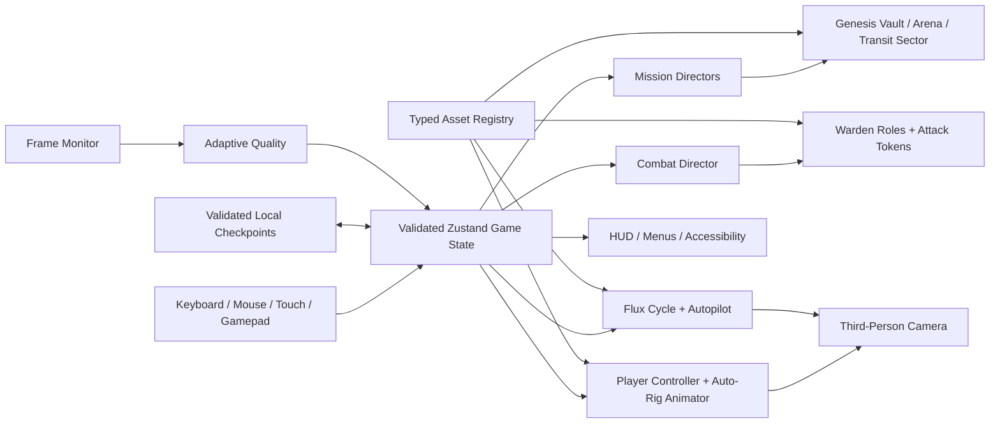

# Aether Grid Architecture

## Core gameplay loop

1. Enter a sector.
2. Receive one clear objective.
3. Explore and learn the next mechanic contextually.
4. Hack or interact with the environment.
5. Fight coordinated Warden roles.
6. Recover mission data.
7. Escape using the Flux Cycle.
8. Save progress and return to the menu.

## Runtime boundaries

- Boot: critical hero, weapon, and hallway assets only
- Campaign: campaign-specific environment, enemies, player, and vehicle assets
- Arena: combat assets only
- Velocity Trial: vehicle, rival, and tunnel assets only
- Optional skyline and traffic: quality-gated
